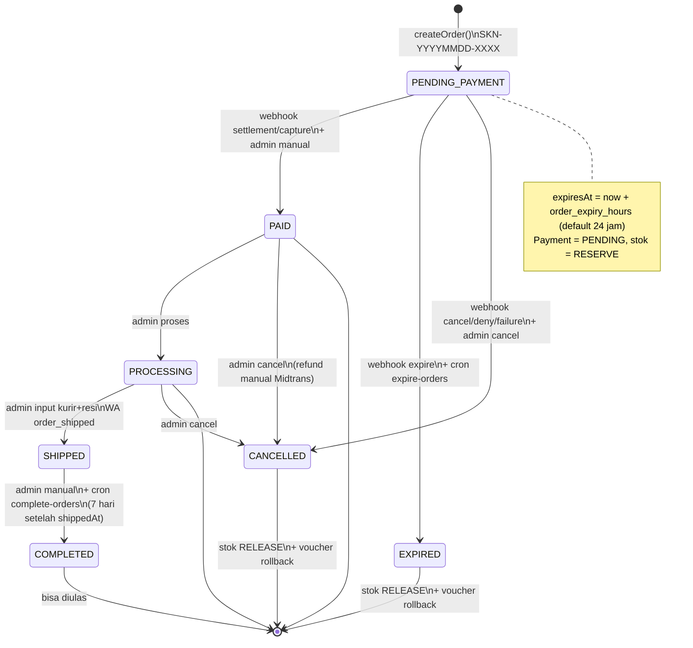
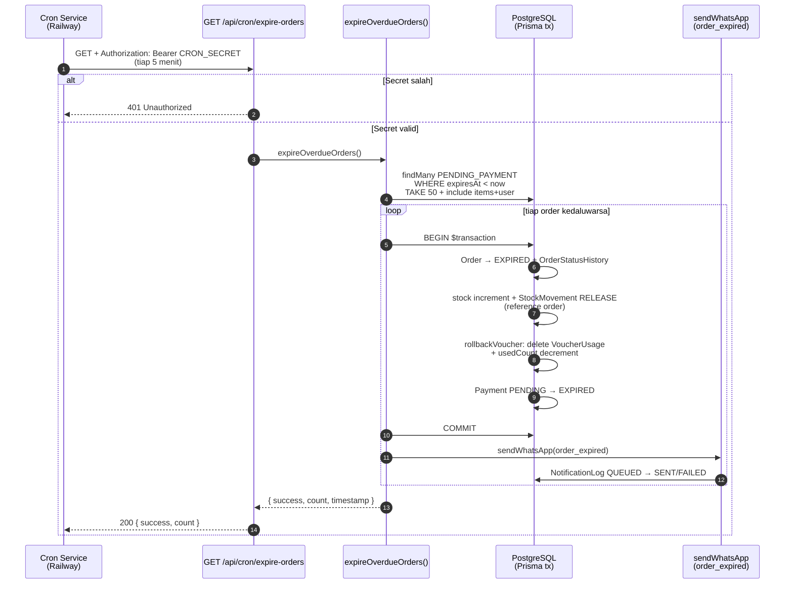
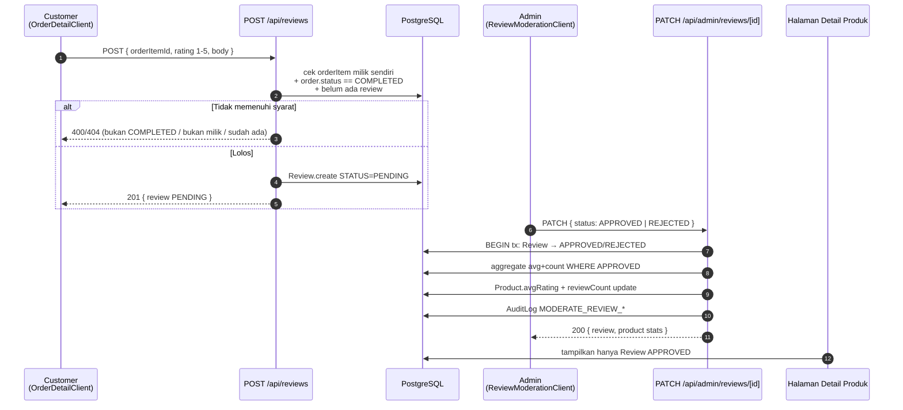
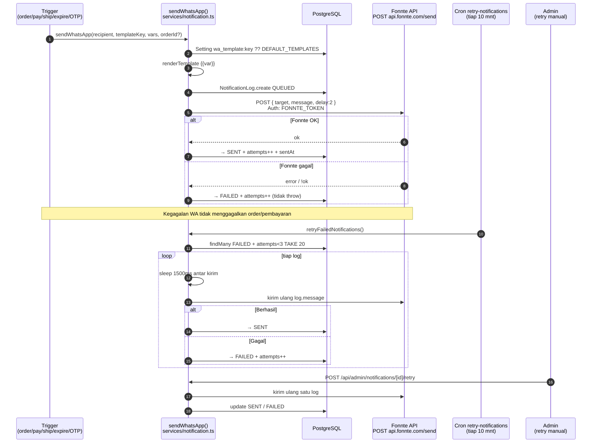
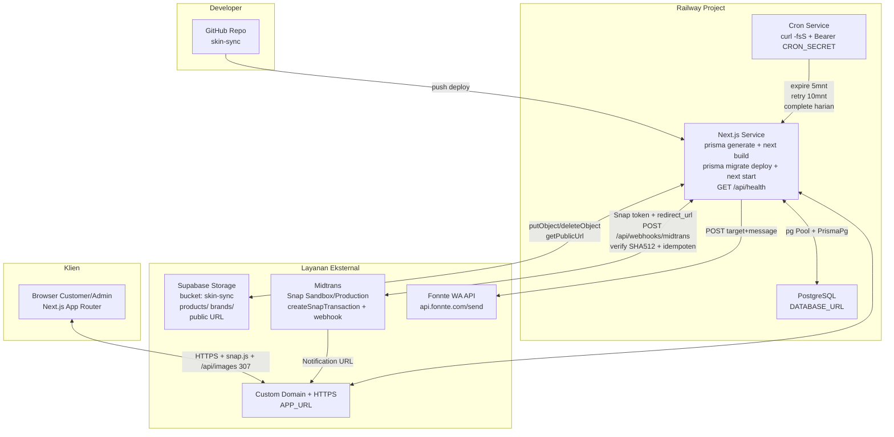
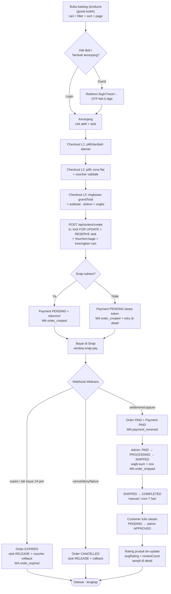
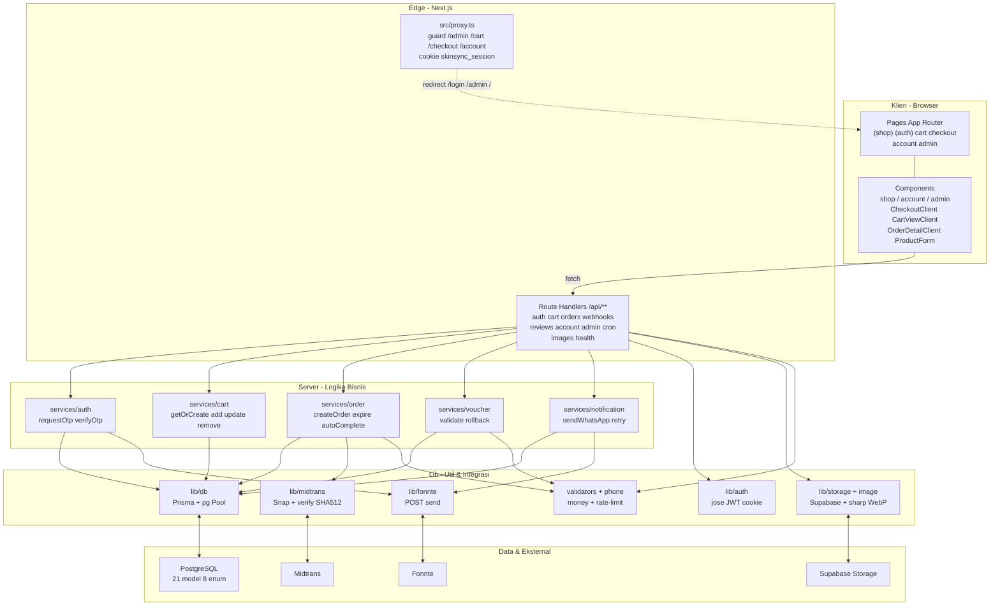

# KUMPULAN DIAGRAM MERMAID — SKINSYNC

> Salin tiap blok ke [Mermaid Live Editor](https://mermaid.live) / blok ` ```mermaid ` di Markdown / Notion / GitHub untuk render.
> Semua diagram disusun dari **kode aktual** (`services/order.ts`, `services/notification.ts`, webhook Midtrans, cron, `proxy.ts`, storage Supabase).

---

## 1. State Diagram — Status Pesanan



---

## 2. Sequence Diagram — Cron Kedaluwarsa Pesanan



---

## 3. Sequence Diagram — Ulasan & Moderasi



---

## 4. Sequence Diagram — Pengiriman Notifikasi & Retry



---

## 5. Diagram Deployment



---

## 6. Flowchart Alur Nilai Utama — Katalog hingga Ulasan



---

## 7. Diagram Arsitektur Sistem


