# Dokumentasi Diagram Sistem — SkinSync (Skincare E-Commerce)

> Proyek: Website penjualan skincare DTC, pasar Indonesia (IDR).
> Stack: Next.js App Router + TypeScript + PostgreSQL + Prisma + Midtrans Snap + Fonnte WA + Railway Bucket.
> Aturan inti: checkout wajib login, voucher wajib login, notifikasi hanya WA, ongkir flat per zona, resi manual, tanpa flash sale.
> File ini memakai [Mermaid](https://mermaid.js.org/) agar langsung render di GitHub / VS Code Preview.

Sumber kebenaran: `plan.md` (Bagian 3 Peran, Bagian 5 Skema, Bagian 6 Aturan Bisnis) dan `prisma/schema.prisma`.

---

## Daftar Isi

1. [Use Case Diagram](#1-use-case-diagram)
2. [UML Class Diagram](#2-uml-class-diagram)
3. [UML Sequence Diagram](#3-uml-sequence-diagram)
4. [Flowchart](#4-flowchart)
5. [ERD (Entity Relationship Diagram)](#5-erd-entity-relationship-diagram)
6. [State Diagram Status Pesanan](#6-state-diagram-status-pesanan)
7. [Cara Render](#7-cara-render)

---

## 1. Use Case Diagram

### 1.1 Daftar Aktor

| Aktor | Keterangan |
|---|---|
| Guest | Belum login. Bukan role di DB. Hanya browsing. |
| Customer | `User.role = CUSTOMER`. Belanja, checkout, ulasan. |
| Admin | `User.role = ADMIN`. Kelola katalog, stok, pesanan, ongkir, voucher, banner, ulasan, laporan. |
| Super Admin | `User.role = SUPER_ADMIN`. Semua hak Admin + kelola akun admin + pengaturan sistem/template WA. |
| Midtrans | Sistem eksternal pembayaran (Snap + webhook). |
| Fonnte | Sistem eksternal pengirim WhatsApp. |
| Cron Railway | Job terjadwal (`expire-orders`, `retry-notifications`, `complete-orders`). |

### 1.2 Diagram

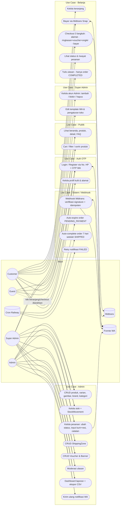

### 1.3 Skenario Use Case Utama

| UC | Precondition | Main Flow | Alternatif |
|---|---|---|---|
| UC3 Login OTP | Nomor HP format `62xxx` | 1. Input HP → 2. Sistem kirim OTP (hash, 5 mnt, max 5x salah, cooldown 60 dtk) → 3. Input OTP benar → sesi cookie httpOnly | Nomor diblokir → tolak. Nomor baru → buat `User CUSTOMER` + minta nama. |
| UC6 Checkout | Login, keranjang tidak kosong | 1. Pilih alamat → 2. Hitung subtotal + ongkir zona + validasi voucher → 3. Transaksi DB (lock stok, buat Order, kurangi stok RESERVE, pakai voucher, kosongkan cart) → 4. Buat Snap Midtrans → 5. Kirim WA `order_created` | Stok kurang → gagal. Zona tidak ketemu → tolak. Voucher invalid → tolak. |
| UC20 Webhook | Signature valid | Verifikasi `SHA512(order_id+status_code+gross_amount+SERVER_KEY)` → cek idempoten `eventKey` → mapping status → update dalam transaksi | Signature salah → 403 + `isValid=false`. Duplikat → 200 tanpa proses. |

---

## 2. UML Class Diagram

Versi ringkas (atribut penting saja). Relasi many-to-many `Product <-> SkinType` dan `Product <-> SkinConcern` memakai tabel implisit Prisma.

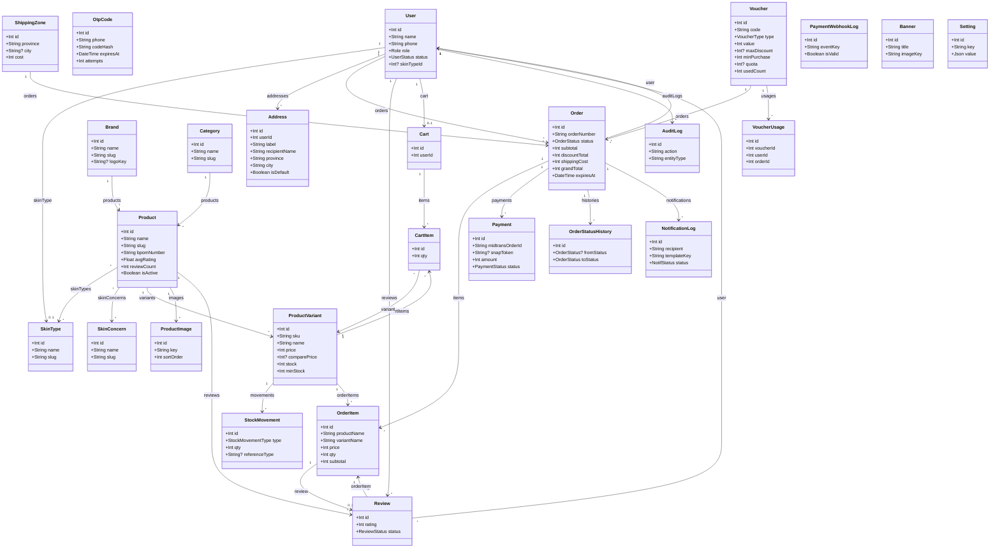

---

## 3. UML Sequence Diagram

### 3.1 Login / Register OTP via WhatsApp

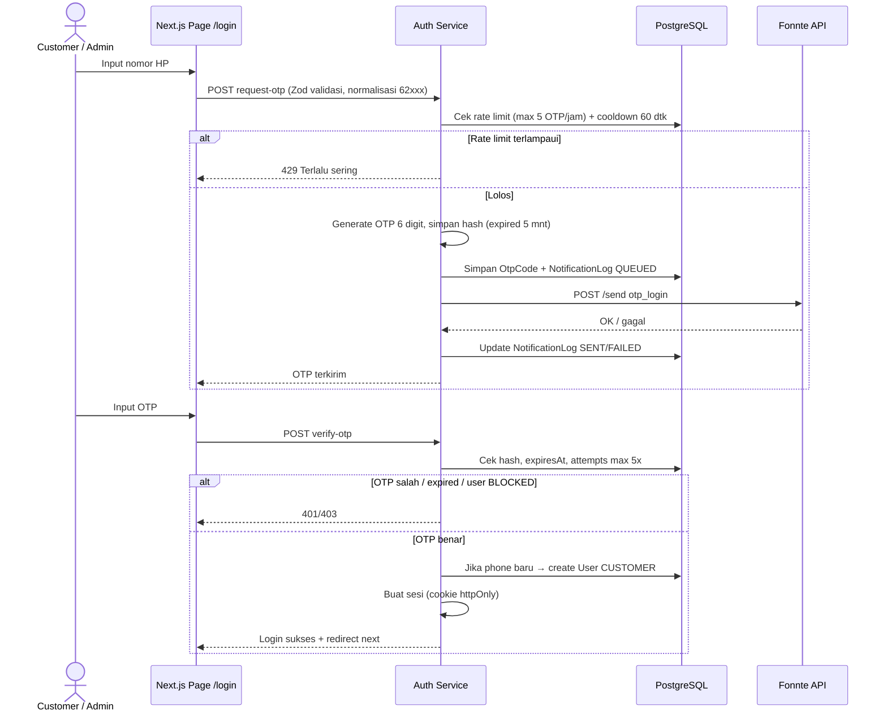

### 3.2 Checkout + Pembayaran (createOrder transaksional)

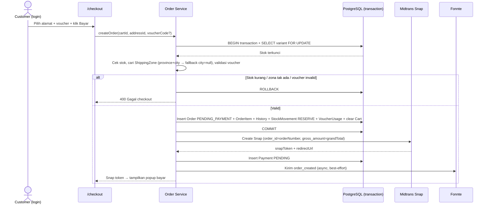

### 3.3 Webhook Midtrans (idempoten)

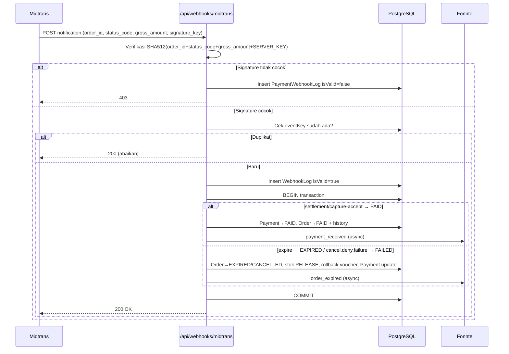

### 3.4 Admin Ubah Status + Input Resi

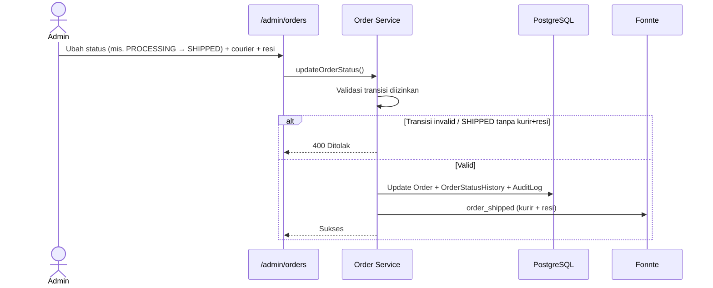

---

## 4. Flowchart

### 4.1 Flowchart Login OTP (Guest → Customer)

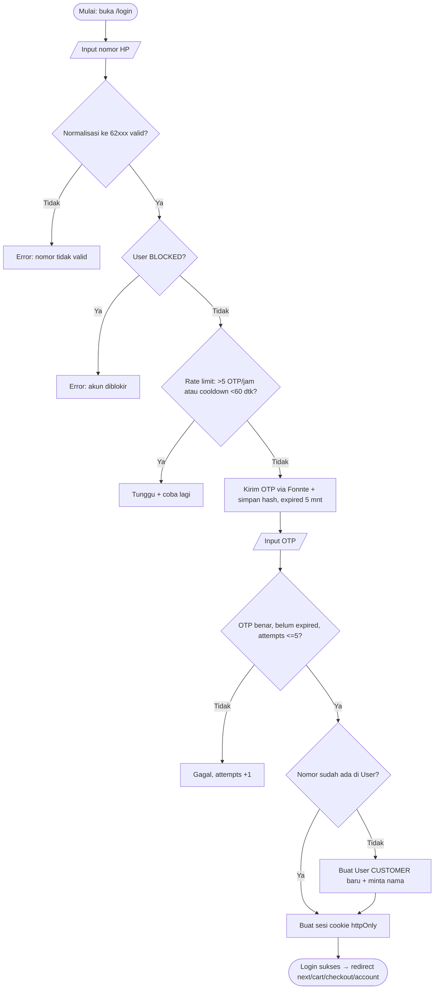

### 4.2 Flowchart Keranjang → Checkout → Bayar

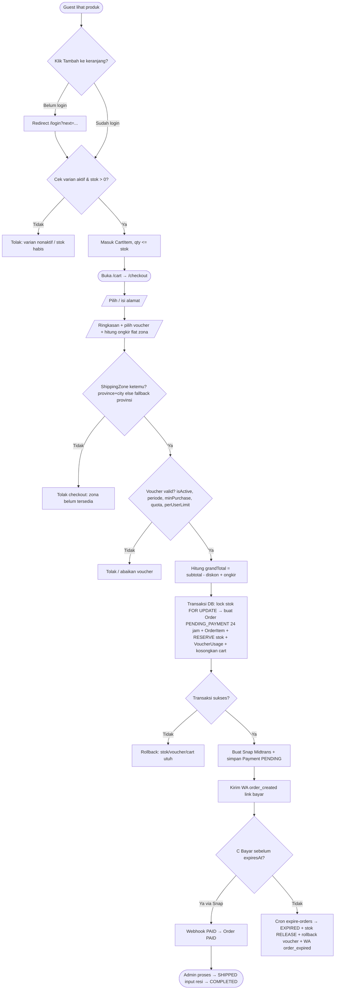

### 4.3 Flowchart Admin Kelola Pesanan

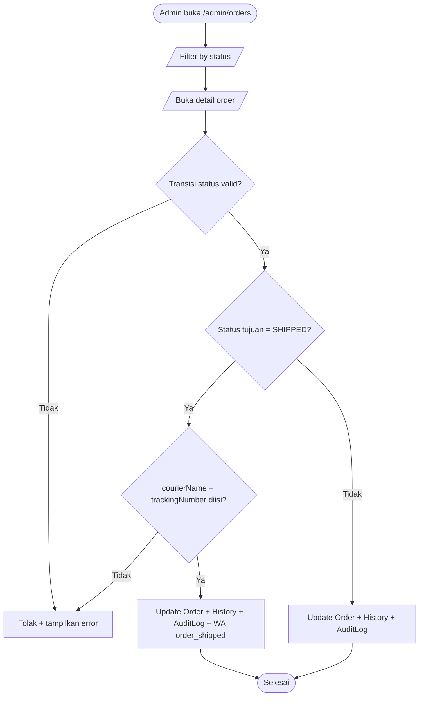

### 4.4 Flowchart Moderasi Ulasan

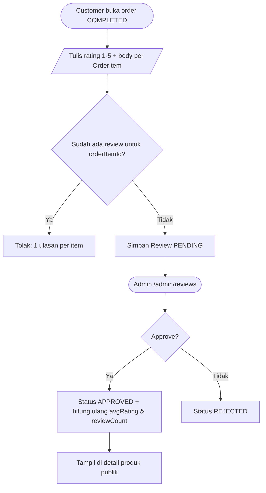

---

## 5. ERD (Entity Relationship Diagram)

> Lengkap sesuai `prisma/schema.prisma`. Uang = `Int` rupiah. Waktu UTC, tampil WIB. Gambar hanya simpan `key` bucket.

```mermaid
erDiagram
    User ||--o{ Address : "has"
    User ||--o{ Order : "places"
    User ||--o{ Review : "writes"
    User ||--o| Cart : "owns"
    User ||--o{ AuditLog : "audits"
    User }o--o| SkinType : "has skinType"

    Brand ||--o{ Product : "has"
    Category ||--o{ Product : "has"
    Product ||--o{ ProductVariant : "has"
    Product ||--o{ ProductImage : "has"
    Product ||--o{ Review : "receives"
    Product }o--o{ SkinType : "suitableFor"
    Product }o--o{ SkinConcern : "targets"

    ProductVariant ||--o{ StockMovement : "tracks"
    ProductVariant ||--o{ CartItem : "in"
    ProductVariant ||--o{ OrderItem : "orderedAs"

    Cart ||--o{ CartItem : "contains"
    Cart }o--|| User : "belongsTo"

    ShippingZone ||--o{ Order : "ships"

    Voucher ||--o{ Order : "appliedTo"
    Voucher ||--o{ VoucherUsage : "usedIn"

    Order ||--o{ OrderItem : "contains"
    Order ||--o{ Payment : "paidBy"
    Order ||--o{ OrderStatusHistory : "history"
    Order ||--o{ NotificationLog : "notifies"
    Order }o--|| User : "buyer"
    Order }o--o| Voucher : "uses"

    OrderItem ||--o| Review : "reviewedBy"

    Review }o--|| Product : "about"
    Review }o--|| User : "author"

    OtpCode {
        int id PK
        string phone
        string codeHash
        datetime expiresAt
        int attempts
    }
    User {
        int id PK
        string name
        string phone UK
        Role role
        UserStatus status
    }
    Address {
        int id PK
        int userId FK
        string label
        string recipientName
        string province
        string city
        string district
        string postalCode
        string addressLine
        boolean isDefault
    }
    Product {
        int id PK
        int brandId FK
        int categoryId FK
        string slug UK
        string bpomNumber
        float avgRating
        int reviewCount
    }
    ProductVariant {
        int id PK
        int productId FK
        string sku UK
        int price
        int stock
        int minStock
    }
    Order {
        int id PK
        string orderNumber UK
        int userId FK
        OrderStatus status
        int subtotal
        int discountTotal
        int shippingCost
        int grandTotal
        datetime expiresAt
    }
    Payment {
        int id PK
        int orderId FK
        string midtransOrderId UK
        int amount
        PaymentStatus status
    }
    PaymentWebhookLog {
        int id PK
        string eventKey UK
        boolean isValid
    }
    Voucher {
        int id PK
        string code UK
        VoucherType type
        int value
    }
    Review {
        int id PK
        int productId FK
        int userId FK
        int orderItemId FK_UK
        int rating
        ReviewStatus status
    }
    NotificationLog {
        int id PK
        int orderId FK_NULL
        string templateKey
        NotifStatus status
    }
```

### 5.1 Catatan Relasi & Constraint Penting

1. `Cart.userId @unique` — satu keranjang per user, wajib login. Guest tidak punya cart.
2. `CartItem @@unique([cartId, variantId])` — varian tidak duplikat dalam satu cart.
3. `VoucherUsage.orderId @unique` — satu order hanya pakai satu voucher sekali.
4. `Review.orderItemId @unique` — satu ulasan per item dibeli, hanya jika `Order COMPLETED`.
5. `Payment.midtransOrderId @unique = Order.orderNumber` — idempotensi pembayaran.
6. `PaymentWebhookLog.eventKey @unique = orderId+status+transaction_id` — webhook idempoten.
7. `Order @@index([userId,status])` dan `@@index([status,expiresAt])` — untuk daftar pesanan + cron expire.
8. `ShippingZone.city = null` berarti berlaku seluruh provinsi (fallback saat checkout).
9. Gambar (`ProductImage.key`, `Brand.logoKey`, `Banner.imageKey`) hanya simpan key bucket (`products/`, `brands/`, `banners/`), bukan URL.

---

## 6. State Diagram Status Pesanan

Aturan `plan.md` 6.6: `PENDING_PAYMENT → PAID → PROCESSING → SHIPPED → COMPLETED`, cabang `EXPIRED`/`CANCELLED` hanya dari `PENDING_PAYMENT` (kecuali admin boleh `CANCELLED` dari `PAID`/`PROCESSING` dengan catatan, refund manual via dashboard Midtrans).

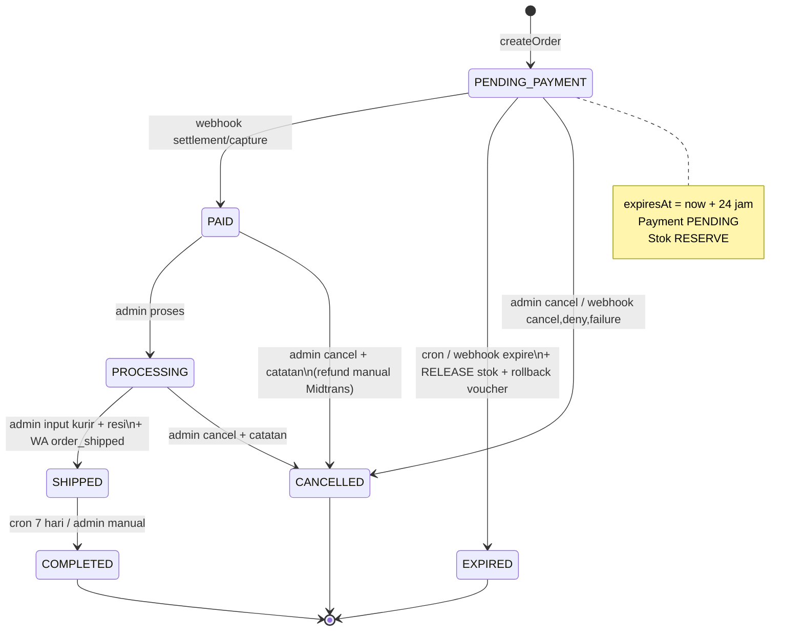

---

## 7. Cara Render

1. Buka file ini di VS Code dengan extension **Markdown Preview Mermaid Support** / **Markdown Preview Enhanced**, atau push ke GitHub (otomatis render).
2. Atau paste tiap blok `mermaid` ke [mermaid.live](https://mermaid.live).
3. Untuk export PNG/SVG: gunakan `mmdc` (mermaid-cli):
   ```bash
   npx @mermaid-js/mermaid-cli -i dokumentasi-diagram.md -o docs.png
   ```
   Atau export per-diagram dari mermaid.live.

---
*Dibuat otomatis dari `plan.md` + `prisma/schema.prisma` SkinSync — sesuaikan jika skema berubah.*
